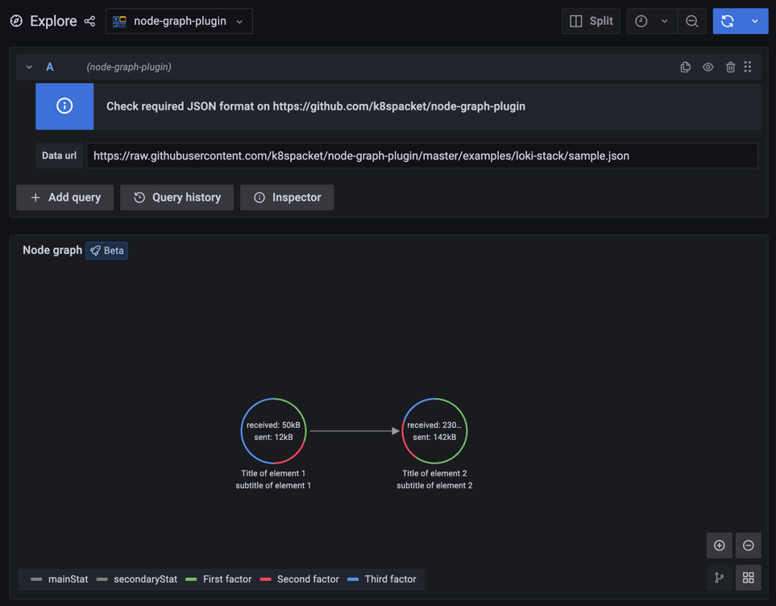

# node-grafana-plugin - loki-stack example

This is a sample of use `node-grafana-plugin` for `loki-stack`.

This plugin is not signed and is not available publicity from Grafana plugins repository yet, so first what you need to do is allow load it by set env variable:

```yaml
  env:
    GF_PLUGINS_ALLOW_LOADING_UNSIGNED_PLUGINS: k-8-s-packet-node-graph-plugin
```

The second step is to use the init container to load the plugin from GitHub releases repo:

```yaml
  extraInitContainers:
    - name: local-plugins-downloader
      image: busybox
      command:
        - /bin/sh
        - -c
        - |
          #!/bin/sh
          set -euo pipefail
          mkdir -p /var/lib/grafana/plugins/node-graph-plugin
          cd /var/lib/grafana/plugins/node-graph-plugin
          for url in https://github.com/k8spacket/node-graph-plugin/releases/download/0.1.0/plugin.zip; do
            wget --no-check-certificate $url -O temp.zip
            unzip temp.zip
            rm temp.zip
          done
      volumeMounts:
        - name: storage
          mountPath: /var/lib/grafana
```

The third and the last step is telling Grafana about using the new datasource plugin:

```yaml
  datasources:
    node-graph-plugin-datasource.yaml:
      apiVersion: 1
      datasources:
      - name: "node-graph-plugin"
        access: "proxy"
        basicAuth: false
        isDefault: false
        readOnly: false
        type: "k-8-s-packet-node-graph-plugin"
        typeLogoUrl: "public/plugins/k-8-s-packet-node-graph-plugin/img/logo.svg"
        typeName: "node-graph-plugin"
        orgId: 1
        version: 1
```

See full example file [promop-values.yaml](promop-values.yaml)

After these steps you will be able to use the plugin in Grafana:

